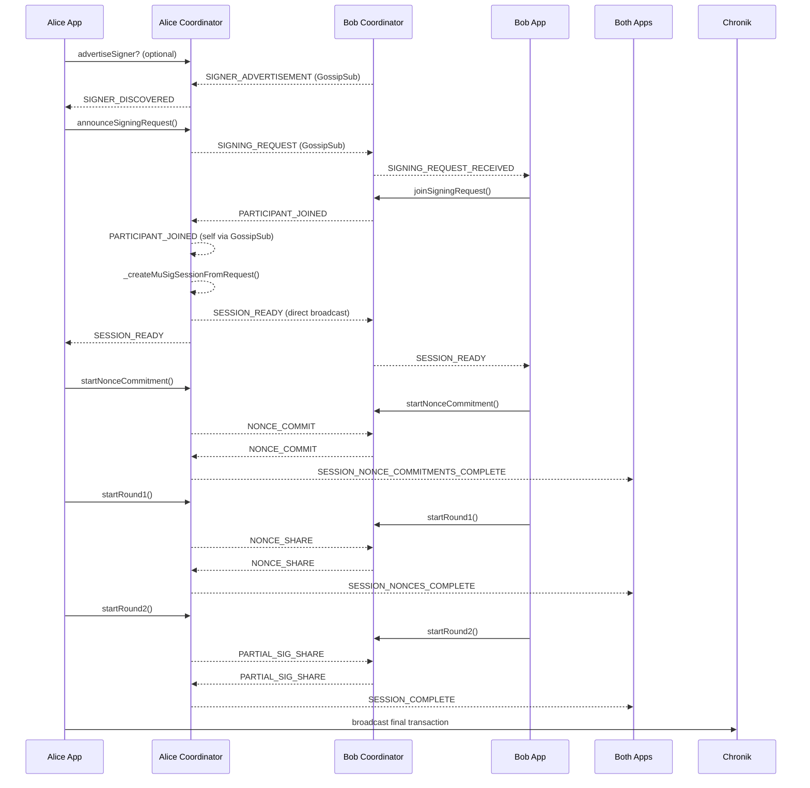

# MuSig2 P2P Coordinator Flow

_Status: Draft – November 20, 2025_

This document walks through the end-to-end control flow executed by `MuSig2P2PCoordinator` during a two-party MuSig2 session. It focuses on the concrete functions invoked, the events emitted, and the network messages exchanged between peers (Alice = request creator, Bob = remote signer).

> **Legend**
>
> - **Event:** `MuSig2Event.*`
> - **Message:** `MuSig2MessageType.*`
> - **Func():** Method on `MuSig2P2PCoordinator`
>
> Code lives under `lib/p2p/musig2/` unless noted otherwise.

---

## 1. Bootstrapping & Subscriptions

| Step | Actor | Function(s)                                         | Result                                                                                        |
| ---- | ----- | --------------------------------------------------- | --------------------------------------------------------------------------------------------- |
| 1.1  | Both  | `new MuSig2P2PCoordinator(p2pConfig, musig2Config)` | Creates coordinator, installs `MuSig2ProtocolHandler` and security manager.                   |
| 1.2  | Both  | `coordinator.start()`                               | Spins up libp2p node, wires event handlers, opens GossipSub topics.                           |
| 1.3  | Bob   | `subscribeToSigningRequests()`                      | Subscribes to `musig2:signing-request` GossipSub topic (size/timestamp/signature validation). |
| 1.4  | Alice | `subscribeToSignerDiscovery([txType])`              | Subscribes to signer advertisement GossipSub topics.                                          |

When GossipSub or direct messages arrive, `MuSig2ProtocolHandler.handleMessage()` routes them, emitting canonical events (see `docs/MUSIG2_BROADCAST_ARCHITECTURE.md`).

---

## 2. Phase 0 – Signer Advertisement

### Alice (consumer)

1. Waits for `SIGNER_DISCOVERED` events → caches advertisements via `_setupThreePhaseEventHandlers()`.

### Bob (provider)

1. Calls `advertiseSignerWithRelay(myPrivateKey, metadata)` → internally signs `SignerAdvertisement`, stores it, and publishes:
   - DHT resource per transaction type.
   - GossipSub message (`SIGNER_ADVERTISEMENT`).
   - Direct broadcast fallback.
2. Protocol handler emits:
   - `SIGNER_ADVERTISED` for Bob (self).
   - `SIGNER_DISCOVERED` for Alice (remote).

Alice selects Bob’s advertisement and proceeds.

---

## 3. Phase 1 – Shared Taproot Preparation (Alice App Logic)

Outside the coordinator, Alice builds the MuSig2 Taproot context (`Bitcore.buildMuSigTaprootKey`) and funds the shared output. Both peers monitor Chronik for the Taproot commitment so that Bob can confirm funding even if Alice’s direct notification fails.

---

## 4. Phase 2 – Signing Request Creation & Distribution

### 4.1 Alice announces request

1. `announceSigningRequest(requiredPublicKeys, message, myPrivateKey, { metadata })`
   - Validates creator key membership and metadata.
   - Generates `requestId`, Schnorr-signs the request payload.
   - Stores `SigningRequest` + `P2PSessionMetadata` keyed by `requestId`.
   - Broadcasts `MuSig2MessageType.PARTICIPANT_JOINED` for herself (creator auto-joins).
   - Publishes `SIGNING_REQUEST` via GossipSub + direct broadcast + DHT resource per signer.

2. Protocol handler receives the self-broadcast and emits `SIGNING_REQUEST_CREATED`, which `_setupThreePhaseEventHandlers()` uses to cache the request locally.

### 4.2 Bob receives request

1. `subscribeToSigningRequests()` catches the GossipSub payload, performs security checks, and forwards it to `MuSig2ProtocolHandler`.
2. `_handleSigningRequest()`:
   - Deserializes keys/message/signature.
   - Emits `SIGNING_REQUEST_RECEIVED` (because `from.peerId !== coordinator.peerId`).
3. Bob’s application code listens for `SIGNING_REQUEST_RECEIVED` and calls `joinSigningRequest()`.

---

## 5. Phase 3 – Dynamic Session Building

### 5.1 Bob joins signing request

`joinSigningRequest(requestId, myPrivateKey)` performs:

1. Request lookup (cache → DHT fallback).
2. Signature verification on creator payload.
3. Metadata initialization (participants map, private key reference).
4. Participant signature creation (`PARTICIPANT_JOINED` message broadcast via GossipSub + direct).
5. If metadata now contains all required signers, call `_createMuSigSessionFromRequest(requestId)`.

### 5.2 PARTICIPANT_JOINED handler (all peers)

`MuSig2ProtocolHandler._handleParticipantJoined()` emits `MuSig2Event.PARTICIPANT_JOINED` for everyone. `_setupThreePhaseEventHandlers()` processes it under the state mutex:

1. Validates the participant’s Schnorr proof.
2. Updates `metadata.participants` and `peerId` mappings.
3. If the map size equals `requiredPublicKeys.length`, invoke `_createMuSigSessionFromRequest(requestId)`.

### 5.3 Session creation & ready broadcast

`_createMuSigSessionFromRequest()`:

1. Calls `_ensureLocalSession(metadata, requestId)` to instantiate a `MuSigSession` via `MuSigSessionManager` (includes storing both `requestId` and `sessionId` keys).
2. Determines coordinator via `_getCoordinatorState()`:
   - If `enableCoordinatorElection` is true, run `electCoordinator()`.
   - Otherwise default to request creator.
3. **Coordinator only**: `_broadcastSessionReady(requestId, sessionId, coordinatorIndex)` (currently direct stream broadcast only) + delete `signingRequests` entry + `SESSION_READY` event emission.

### 5.4 Remote SESSION_READY handling

`MuSig2ProtocolHandler._handleSessionReady()` forwards to `handleRemoteSessionReady(payload)`:

1. Rehydrates metadata via `_ensureLocalSession()` if needed.
2. Optionally records coordinator participant info.
3. Deletes stale `signingRequests` mapping.
4. Emits `SESSION_READY` so local applications begin Round 0 (nonce commitments).

> **Note:** Because `_broadcastSessionReady` doesn’t use GossipSub yet, peers depend on active direct connections to receive this event.

---

## 6. Round 0 – Nonce Commitments

| Step | Actor       | Function(s)                                                                      | Notes                                                                                                        |
| ---- | ----------- | -------------------------------------------------------------------------------- | ------------------------------------------------------------------------------------------------------------ |
| 6.1  | Both        | `startNonceCommitment(sessionId, myPrivateKey)` (triggered by `SESSION_READY`)   | Generates public nonces (if needed), hashes them via `_computeNonceCommitment()`, broadcasts `NONCE_COMMIT`. |
| 6.2  | Both        | `_handleNonceCommit(sessionId, signerIndex, sequenceNumber, commitment, peerId)` | Validates phase + sequence numbers, records commitment, updates participant mapping.                         |
| 6.3  | Coordinator | `_handleAllNonceCommitmentsReceived()`                                           | Once all commitments collected, sets `nonceCommitmentsComplete`, emits `SESSION_NONCE_COMMITMENTS_COMPLETE`. |

Commitment verification happens later in `_handleNonceShare()`, ensuring revealed nonces match their pre-image.

---

## 7. Round 1 – Nonce Exchange

| Step | Actor       | Function(s)                                                                                | Notes                                                                                                   |
| ---- | ----------- | ------------------------------------------------------------------------------------------ | ------------------------------------------------------------------------------------------------------- |
| 7.1  | Both        | `startRound1(sessionId, myPrivateKey)` (triggered by `SESSION_NONCE_COMMITMENTS_COMPLETE`) | Shares public nonces (using existing cached value), updates session phase, broadcasts `NONCE_SHARE`.    |
| 7.2  | Both        | `_handleNonceShare(sessionId, signerIndex, sequenceNumber, publicNonce, peerId)`           | Validates phase + sequence numbers, verifies commitment, stores nonce, updates `metadata.participants`. |
| 7.3  | Coordinator | `_handleAllNoncesReceived()`                                                               | Once all nonces collected, transitions to `PARTIAL_SIG_EXCHANGE`, defers `SESSION_NONCES_COMPLETE`.     |

Sequence numbers (per signer) provide replay protection; violations trigger errors and optional security penalties.

---

## 8. Round 2 – Partial Signatures

1. `SESSION_NONCES_COMPLETE` event causes each peer to call `startRound2(sessionId, myPrivateKey)`.
2. `startRound2()` checks phase, creates partial sig (Taproot-aware if metadata indicates), broadcasts `PARTIAL_SIG_SHARE`.
3. `_handlePartialSigShare()` verifies sequence numbers + partial signature via `MuSigSessionManager.receivePartialSignature()`.
4. When all shares arrive, `_handleAllPartialSigsReceived()` aggregates the final signature, sets session phase to COMPLETE, and emits `SESSION_COMPLETE`.

---

## 9. Finalization & Broadcast

1. Application layer calls `getFinalSignature(sessionId)` → retrieves aggregated signature and auto-sets `nhashtype` based on `metadata.inputScriptType` (Taproot vs P2PKH).
2. Transaction builder (e.g., Alice’s `peer1.ts`) injects the signature into the spending transaction and broadcasts it via Chronik.

---

## 10. Cleanup & Failover

- `closeSession(sessionId)` removes session/metadata, emits `SESSION_CLOSED`, and broadcasts `SESSION_ABORT` to peers if needed.
- If `enableCoordinatorFailover` is true, `_handleAllPartialSigsReceived()` schedules `_initializeCoordinatorFailover()`; timeouts trigger `triggerCoordinatorFailover()` to nominate backup coordinators (using the same election method).
- Periodic `cleanup()` prunes expired signing requests or stuck sessions based on `sessionTimeout` / `stuckSessionTimeout` settings.

---

## 11. End-to-End Sequence Diagram

---

## 12. Key Call Graph Snapshot

| Phase           | Primary Functions                                                                                                   |
| --------------- | ------------------------------------------------------------------------------------------------------------------- |
| Bootstrapping   | `start()`, `subscribeToSignerDiscovery()`, `subscribeToSigningRequests()`                                           |
| Advertisement   | `advertiseSignerWithRelay()`, `_setupThreePhaseEventHandlers()`                                                     |
| Signing Request | `announceSigningRequest()`, `_handleSigningRequest()`                                                               |
| Join Flow       | `joinSigningRequest()`, `_handleParticipantJoined()`, `_createMuSigSessionFromRequest()`                            |
| Session Ready   | `_ensureLocalSession()`, `_getCoordinatorState()`, `_broadcastSessionReady()`, `handleRemoteSessionReady()`         |
| Round 0         | `startNonceCommitment()`, `_broadcastNonceCommit()`, `_handleNonceCommit()`, `_handleAllNonceCommitmentsReceived()` |
| Round 1         | `startRound1()`, `_broadcastNonceShare()`, `_handleNonceShare()`, `_handleAllNoncesReceived()`                      |
| Round 2         | `startRound2()`, `_broadcastPartialSigShare()`, `_handlePartialSigShare()`, `_handleAllPartialSigsReceived()`       |

---

## 13. Open Observations

1. `SESSION_READY` currently uses direct broadcast only; relayed peers may miss it if connections drop after signing request publication.
2. Coordinator election defaults remain enabled. For 2-of-2 demos, set `musig2Config.enableCoordinatorElection = false` (and disable failover) to keep the request creator authoritative.
3. Nonce commitment is now integrated; Sybil protection and broader DoS controls documented elsewhere remain future enhancements.

---

_This document is intended to serve as a “living” flow reference. Update it whenever coordinator message routing, election/failover, or session-metadata handling changes._
